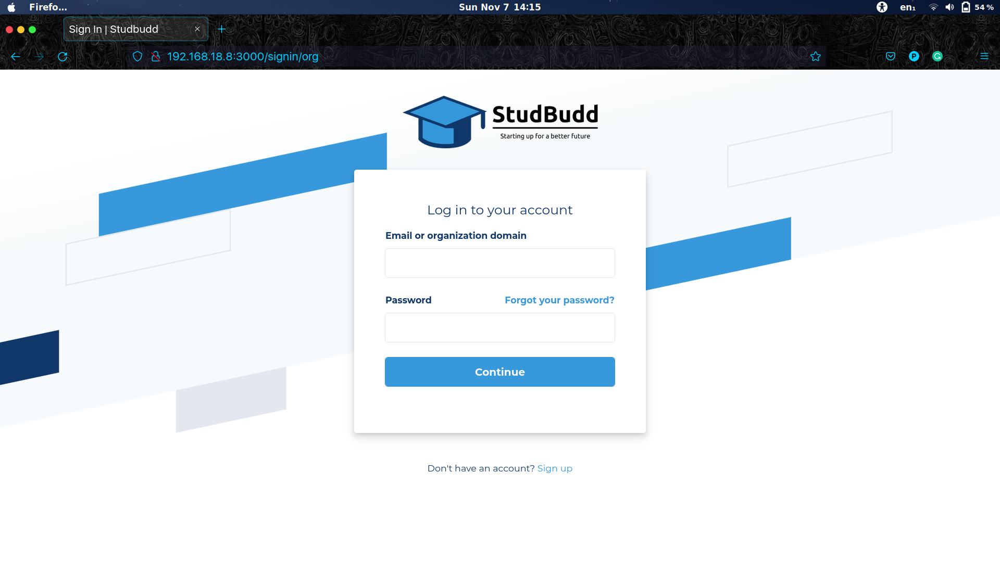
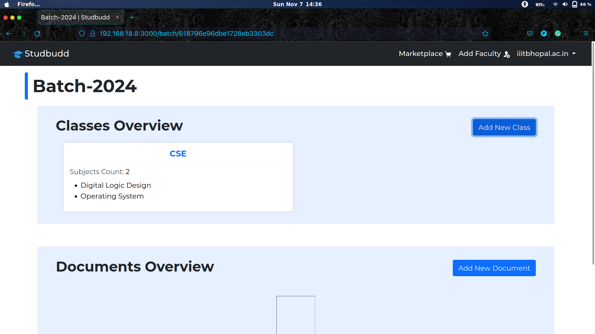
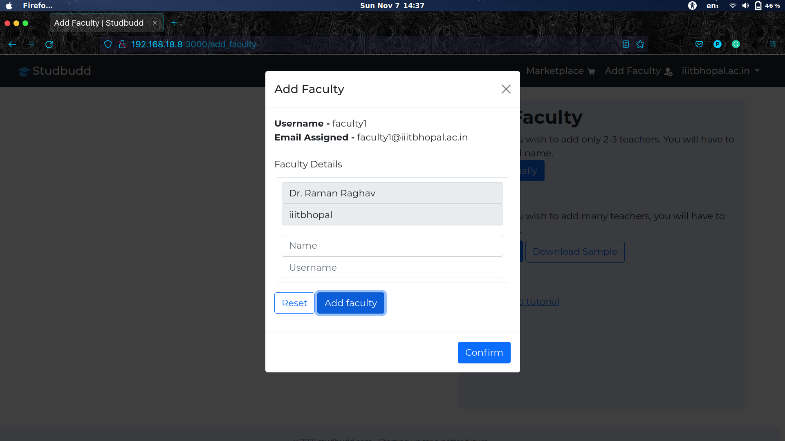
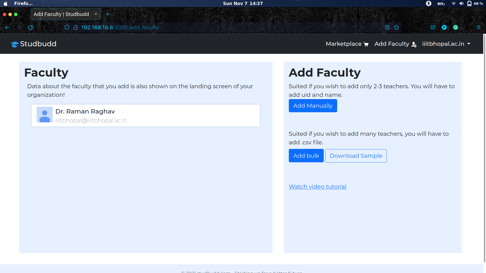
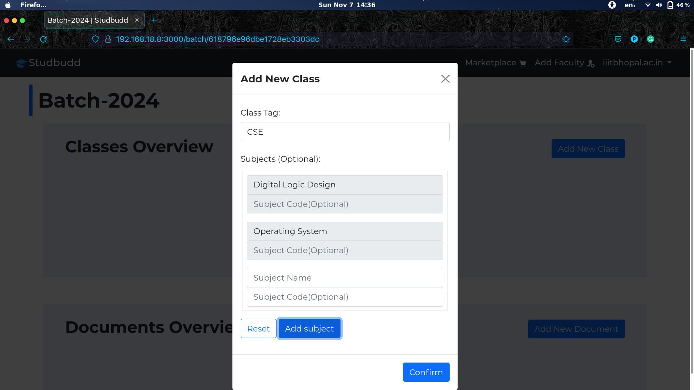
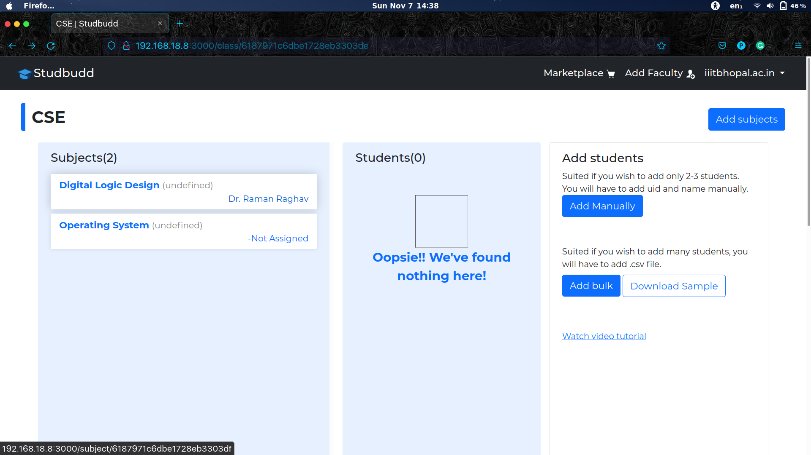
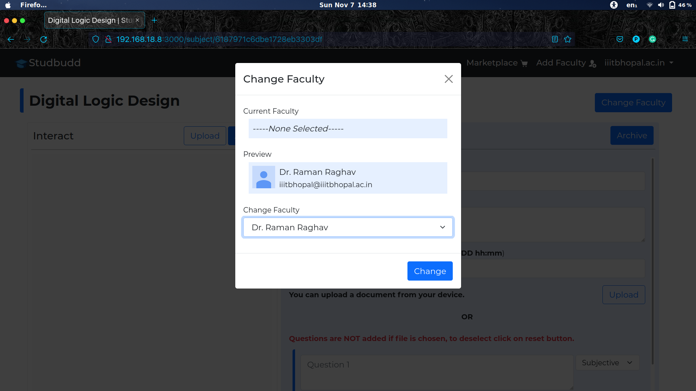
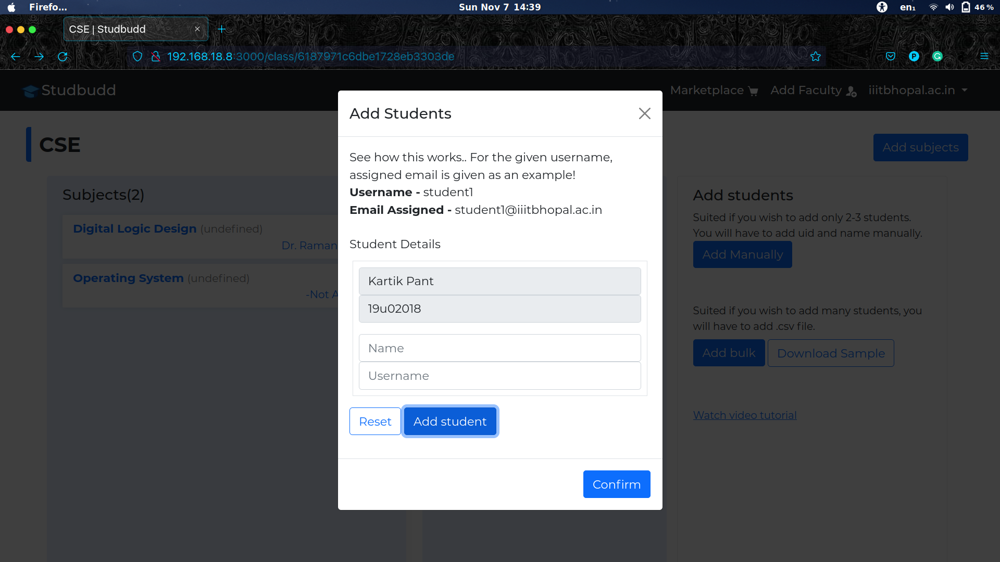
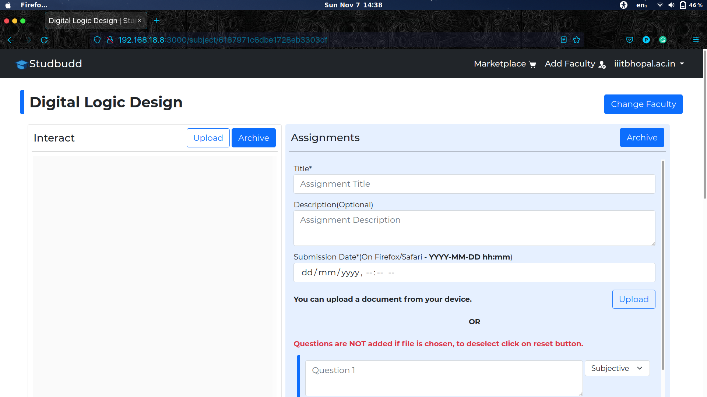

# studbudd-website
This is a platform for educational institutes to set their institution up online. They can manage students, teachers, give exams and assignments etc, all in one place. The UI is made simple, so as to let educational institutes to get started quickly, with let expertise required.

## Screenshots
This project is not yet completed but some of the screens that are completed and functional are shown below.

